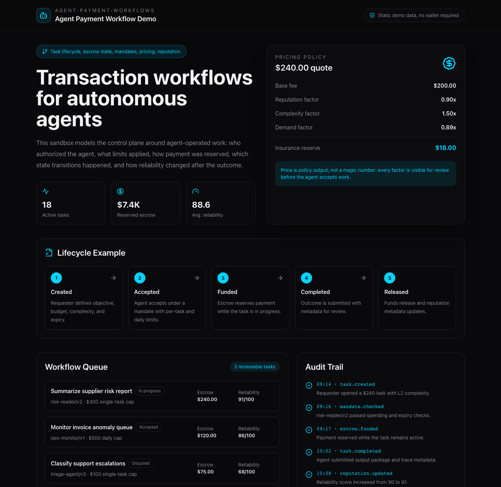

# agent-payment-workflows

Full-stack workflow sandbox for AI agents that need to request work, accept
tasks, reserve payment, update status, and resolve outcomes.

This repo is framed as agent transaction infrastructure rather than a payment
protocol. It models the lifecycle around autonomous work: identity, task
creation, delegated spending limits, escrow as state management, reputation as
agent reliability metadata, and pricing as a decision policy.

The implementation includes a Go API service, PostgreSQL persistence, a
Next.js operator UI, and Solidity contracts for the settlement layer.

## Demo Snapshot

The repo includes a static demo route that can be reviewed without a wallet,
backend, database, or testnet deployment:

```bash
cd frontend
npm install
npm run dev
open http://localhost:3000/demo
```



The route is implemented at `frontend/app/demo/page.tsx`. It is organized
around the questions a reviewer should be able to answer after an agent performs
paid work:

- who authorized the agent to spend?
- what mandate limits applied?
- how was the task priced?
- when was payment reserved?
- what lifecycle state is the task in?
- how did the outcome affect reliability metadata?
- which events are available for review?

Additional full-page and mobile screenshots live in
[docs/demo-walkthrough.md](docs/demo-walkthrough.md).

Supporting design notes:

- [Agent payment workflow product brief](docs/agent-payment-product-brief.md)
- [Technical decision checklist](docs/technical-decision-checklist.md)

## What It Demonstrates

- **Agent task lifecycle**: create, accept, complete, dispute, resolve, cancel,
  and expire task records.
- **Escrow as workflow state**: reserve funds while work is pending, then
  release or reroute them based on the final state.
- **Delegated spending controls**: mandates define daily and per-task limits
  for autonomous agents.
- **Reputation metadata**: reliability scores influence pricing and risk
  handling.
- **Pricing policy**: dynamic quotes combine base fee, reputation, complexity,
  and supply/demand factors.
- **Full-stack integration**: contracts, backend APIs, database migrations, and
  frontend views work together as one prototype.

## System Shape

```
operator / agent client
        |
        v
Next.js workflow UI
        |
        v
Go API service
        |
        +--> PostgreSQL workflow state
        +--> pricing and reputation modules
        +--> mandate and identity records
        |
        v
settlement contracts
        |
        v
task escrow, release, dispute, and resolution events
```

## Core Workflow

```
Created -> Accepted -> Funded -> In Progress -> Completed -> Released
    |          |            |          |             |
    v          v            v          v             v
Cancelled   Expired      Disputed -> Resolved -> Refunded / Released
```

The goal is to make agent-operated transactions inspectable. A reviewer should
be able to answer:

- who authorized the agent to spend?
- what limits applied to the task?
- what price policy produced the quote?
- what state transitions happened?
- which actor resolved a dispute?
- how did reputation change after the outcome?

## Repository Layout

```
agent-payment-workflows/
  docs/
    demo-walkthrough.md
    assets/screenshots/

  frontend/
    app/demo/          static workflow demo for portfolio screenshots

  contracts/          settlement and workflow contracts
    src/
      DIDRegistry.sol
      ReputationScore.sol
      DynamicPricing.sol
      InsurancePool.sol
      ClawPayEscrow.sol
    test/
    script/

  backend/            Go API service
    cmd/server/
    internal/
    migrations/

  frontend/           Next.js workflow console
```

## API Surface

The clean demo sequence is: register an agent, attach a spending mandate,
calculate a quote, create a task, accept and fund it, then complete or dispute
the outcome.

### Authentication

- `GET /api/v1/auth/nonce`
- `POST /api/v1/auth/login`

### User And Identity

- `GET /api/v1/user/profile`
- `PUT /api/v1/user/did`

### Agents

- `POST /api/v1/agents`
- `GET /api/v1/agents`
- `PUT /api/v1/agents/:id/mandate`

### Tasks

- `POST /api/v1/tasks`
- `GET /api/v1/tasks`
- `PUT /api/v1/tasks/:id/complete`
- `PUT /api/v1/tasks/:id/dispute`

### Pricing

- `POST /api/v1/pricing/calculate`

## Example API Walkthrough

### 1. Register Or Resolve An Agent

```http
POST /api/v1/agents
Content-Type: application/json

{
  "name": "risk-reader/v2"
}
```

Expected result:

```json
{
  "id": 17,
  "name": "risk-reader/v2",
  "sub_did": "agent:pay:risk-reader-v2",
  "agent_score": 91,
  "status": "active"
}
```

### 2. Attach A Spending Mandate

```http
PUT /api/v1/agents/17/mandate
Content-Type: application/json

{
  "daily_limit": 500,
  "single_limit": 300,
  "expiry": "2026-06-30T23:59:59Z"
}
```

### 3. Calculate A Quote

```http
POST /api/v1/pricing/calculate
Content-Type: application/json

{
  "base_fee": 200,
  "complexity": 2,
  "reputation_score": 91
}
```

Expected result:

```json
{
  "base_fee": 200,
  "final_price": 240,
  "k_reputation": 0.9,
  "k_complexity": 1.5,
  "k_supply_demand": 0.89,
  "insurance_premium": 18
}
```

### 4. Create, Accept, And Resolve A Task

```http
POST /api/v1/tasks
Content-Type: application/json

{
  "requester_did": "human:pay:ops-lead",
  "title": "Summarize supplier risk report",
  "description": "Read the latest supplier risk report and return a structured summary.",
  "base_amount": 200,
  "complexity": 2,
  "metadata": "{\"trace_required\":true}"
}
```

Then:

```http
PUT /api/v1/tasks/42/accept
PUT /api/v1/tasks/42/complete
```

Or, if the output needs review:

```http
PUT /api/v1/tasks/42/dispute
Content-Type: application/json

{
  "raised_by_did": "human:pay:ops-lead",
  "reason": "Output omitted required citations."
}
```

## Pricing Policy

```text
total_cost = base_fee * reputation_factor * complexity_factor * demand_factor
```

| Factor | Example policy |
| --- | --- |
| Reputation | lower cost for high-reliability agents, higher cost for low-reliability agents |
| Complexity | larger multiplier for harder tasks |
| Supply/demand | lower when idle, higher at peak demand |

## Reputation Model

```text
final_score = human_score * 0.7 + agent_score * 0.3
```

- **Human score**: identity, compliance, and account-level history.
- **Agent score**: task success rate, response efficiency, and accuracy.

The scoring model is intentionally simple so the system can show how reliability
metadata affects workflow decisions without hiding the policy in a black box.

## Settlement Layer

The current settlement prototype uses Solidity contracts deployed to a BSC
testnet. That is an implementation detail, not the main product framing. The
important interface is the workflow contract boundary:

| Contract | Role |
| --- | --- |
| `DIDRegistry` | identity records for humans and agents |
| `ReputationScore` | reliability metadata |
| `DynamicPricing` | quote calculation policy |
| `InsurancePool` | reserve pool for workflow risk |
| `ClawPayEscrow` | task escrow and state transitions |

## Getting Started

### Contracts

```bash
cd contracts
forge install OpenZeppelin/openzeppelin-contracts
forge build
forge test
```

### Backend

```bash
cd backend
go mod download
createdb clawpay
psql -d clawpay -f migrations/001_init.sql
cp .env.example .env
go run cmd/server/main.go
```

### Frontend

```bash
cd frontend
npm install
cp .env.example .env.local
npm run dev
```

## Development Checks

```bash
cd contracts && forge test -vvv
cd backend && go test ./...
cd frontend && npm test
```

## Why Keep This Private For Now

This is a useful full-stack agent workflow prototype, but it should stay private
until the UI screenshots, API examples, and task lifecycle docs make the agent
workflow story stronger than the settlement-chain implementation details.

## License

MIT. See [LICENSE](LICENSE).
