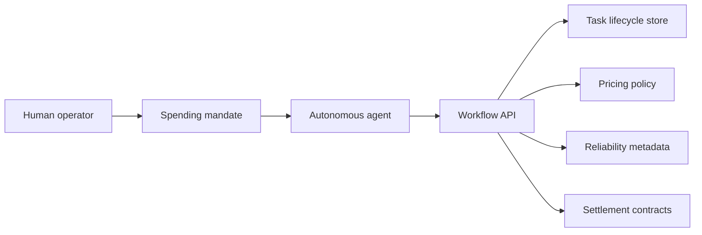
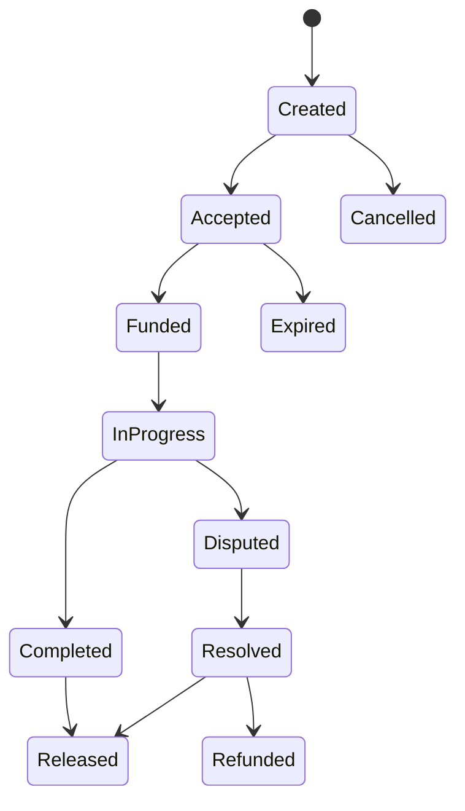

# Agent Payment Workflow Product Brief

This document reframes the original ClawPay concept as an AI-agent workflow infrastructure prototype. The useful portfolio signal is not a token protocol; it is the system design around authorization, task state, payment reservation, pricing, and outcome review for autonomous work.

## Problem

AI agents can increasingly research, write code, call APIs, and coordinate tasks, but they still need controlled ways to spend, accept work, and prove what happened. Human payment rails are slow, account-centric, and difficult to delegate safely to autonomous software.

The prototype explores a workflow layer where agents can operate under explicit human mandates while every task keeps a clear audit trail.

## Core Product Thesis

Agent-operated transactions need five primitives:

1. **Identity**: a human root identity and agent-specific sub-identities.
2. **Mandates**: signed spending policies that define per-task and daily limits.
3. **Task lifecycle state**: created, accepted, funded, completed, disputed, resolved, released, or refunded.
4. **Escrow-like reservation**: payment is reserved while work is pending and released only after a valid outcome.
5. **Reliability metadata**: reputation scores and task history become machine-readable signals for future pricing and routing.

## System Components

## Workflow

## Product Surface

| Area | What it demonstrates |
| --- | --- |
| Operator console | Humans can inspect agents, limits, task state, and outcomes. |
| Agent SDK/API | Agents can create tasks, accept tasks, and submit completion events. |
| Pricing module | Quotes can account for complexity, reputation, and supply/demand. |
| Reputation module | Task outcomes update reliability metadata. |
| Settlement layer | Escrow/release/dispute events are represented as verifiable workflow transitions. |

## Portfolio Positioning

Lead with:

- agent transaction workflows;
- delegated spending controls;
- workflow state management;
- reliability and pricing metadata;
- full-stack systems prototype.

Avoid leading with:

- token branding;
- chain-specific deployment details;
- speculative protocol language;
- payment-protocol claims before the workflow demo is understood.
