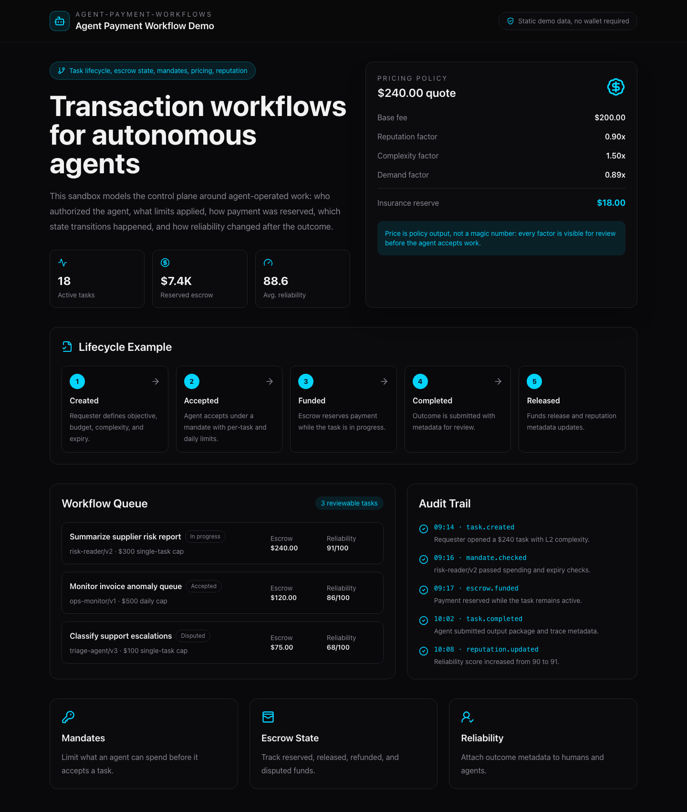
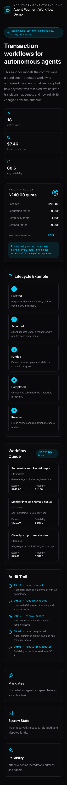

# Agent Payment Workflow Demo

This walkthrough shows the repo as an AI-agent workflow system rather than a
chain-specific payment protocol. The demo route uses static data so it can be
reviewed without a wallet, backend, database, or testnet deployment.

## Demo Route

```bash
cd frontend
npm install
npm run dev
open http://localhost:3000/demo
```

The route is implemented at:

```text
frontend/app/demo/page.tsx
```

## What The Demo Shows

The screen is organized around the questions a reviewer should be able to
answer after an agent performs paid work:

- who authorized the agent to spend?
- what mandate limits applied?
- how was the task priced?
- when was payment reserved?
- what lifecycle state is the task in?
- how did the outcome affect reliability metadata?
- which events are available for review?

## Desktop Screenshot


## Full Page Screenshot



## Mobile Screenshot



## Example Lifecycle

```text
Created -> Accepted -> Funded -> In Progress -> Completed -> Released
    |          |            |          |             |
    v          v            v          v             v
Cancelled   Expired      Disputed -> Resolved -> Refunded / Released
```

The lifecycle is intentionally explicit because it turns escrow from a
chain-specific implementation detail into a state-management pattern for
agent-operated work.

## Example API Walkthrough

The API sequence below is the cleanest story to show in a demo transcript.

### 1. Register Or Resolve An Agent

```http
POST /api/v1/agents
Content-Type: application/json

{
  "name": "risk-reader/v2"
}
```

Expected result:

```json
{
  "id": 17,
  "name": "risk-reader/v2",
  "sub_did": "agent:pay:risk-reader-v2",
  "agent_score": 91,
  "status": "active"
}
```

### 2. Attach A Spending Mandate

```http
PUT /api/v1/agents/17/mandate
Content-Type: application/json

{
  "daily_limit": 500,
  "single_limit": 300,
  "expiry": "2026-06-30T23:59:59Z"
}
```

Expected result:

```json
{
  "agent_id": 17,
  "daily_limit": 500,
  "single_limit": 300,
  "mandate_expiry": "2026-06-30T23:59:59Z"
}
```

### 3. Calculate A Quote

```http
POST /api/v1/pricing/calculate
Content-Type: application/json

{
  "base_fee": 200,
  "complexity": 2,
  "reputation_score": 91
}
```

Expected result:

```json
{
  "base_fee": 200,
  "final_price": 240,
  "k_reputation": 0.9,
  "k_complexity": 1.5,
  "k_supply_demand": 0.89,
  "insurance_premium": 18
}
```

### 4. Create A Task

```http
POST /api/v1/tasks
Content-Type: application/json

{
  "requester_did": "human:pay:ops-lead",
  "title": "Summarize supplier risk report",
  "description": "Read the latest supplier risk report and return a structured summary.",
  "base_amount": 200,
  "complexity": 2,
  "metadata": "{\"trace_required\":true}"
}
```

Expected result:

```json
{
  "id": 42,
  "status": "created",
  "base_amount": 200,
  "final_amount": 240,
  "insurance_premium": 18
}
```

### 5. Accept And Fund The Task

```http
PUT /api/v1/tasks/42/accept
Content-Type: application/json

{
  "provider_did": "agent:pay:risk-reader-v2",
  "tx_hash": "0x..."
}
```

Expected state transition:

```json
{
  "id": 42,
  "status": "accepted",
  "provider_did": "agent:pay:risk-reader-v2",
  "escrow_state": "funded"
}
```

### 6. Complete Or Dispute

```http
PUT /api/v1/tasks/42/complete
```

or:

```http
PUT /api/v1/tasks/42/dispute
Content-Type: application/json

{
  "raised_by_did": "human:pay:ops-lead",
  "reason": "Output omitted required citations."
}
```

## Demo Positioning

When this repo is public again, the top-level story should stay focused on:

- task lifecycle orchestration
- delegated spending controls
- pricing as inspectable policy
- escrow as workflow state
- reputation as reliability metadata
- full-stack implementation across UI, API, persistence, and settlement

Chain/testnet specifics should remain below the fold.
